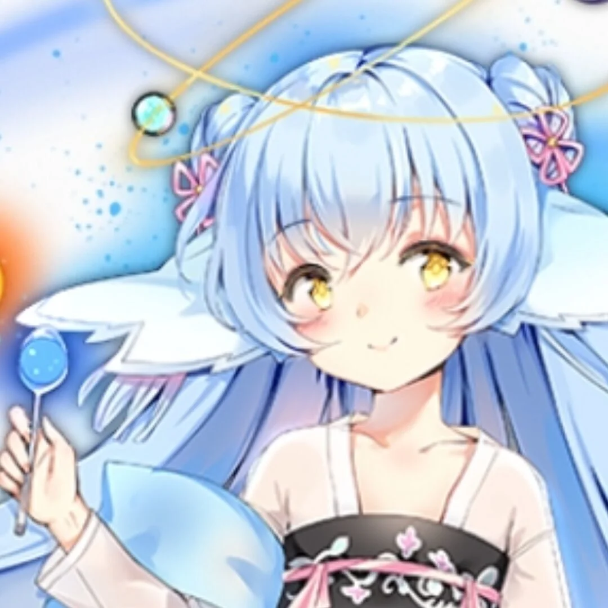
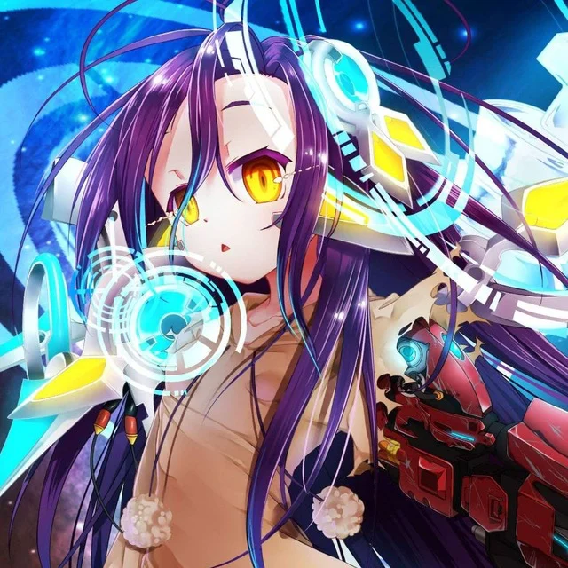
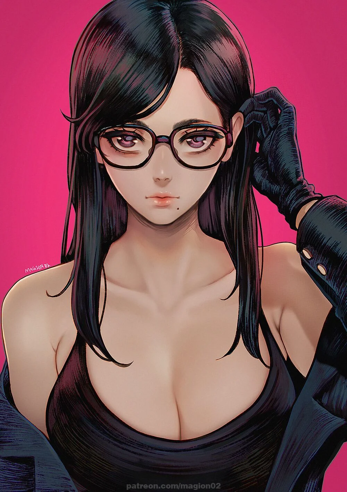

# 我的朋友们

## 友链：
* 以名字首字母顺序从上到下排列：  
  
::: details Alice Aierlanta

blog：<a href="https://blog.aierlanta.net/" target="_blank" rel="noreferrer">https://blog.aierlanta.net/</a>
:::

::: details Anthony Summit

blog：<a href="https://csmoe.top/" target="_blank" rel="noreferrer">https://csmoe.top/</a>
:::

::: details 鲲

blog：<a href="https://soft.moe/" target="_blank" rel="noreferrer">https://soft.moe/</a>
:::

::: details LC

blog：<a href="https://lcwebsite.cn/" target="_blank" rel="noreferrer">https://lcwebsite.cn/</a>
:::

::: details listder

blog：<a href="https://blog.listder.xyz/" target="_blank" rel="noreferrer">https://blog.listder.xyz/</a>
:::

::: details 洛华

blog：<a href="https://luohua.moe/" target="_blank" rel="noreferrer">https://luohua.moe/</a>
:::

::: details MikuMeow

github：<a href="https://github.com/18650official" target="_blank" rel="noreferrer">https://github.com/18650official</a>
:::

::: details Toshiki

blog：<a href="https://toshiki.dev" target="_blank" rel="noreferrer">https://toshiki.dev</a>
:::

::: details 小月月

blog：<a href="https://canyat.github.io/" target="_blank" rel="noreferrer">https://canyat.github.io/</a>
:::

## 感谢 
  
* 首先是要感谢鲲！他的努力和开朗能让认识他的人得到力量！他的前端技术很扎实，能做好全栈开发，在包括但不限于本blog的搭建上帮助了我很多！从买域名开始教我，然后就是如何把域名给`cloudflare`托管，与`github pages`链接起来，并推荐了`vitepress`这个简单易用的框架，一步步教会我这样一个完全不懂前端的萌新使用这个框架，并将网页部署到`github pages`上  
本blog一开始的`vitepress`框架也是他生成给我展示后，我再慢慢跟着官方文档和他的指导把blog做好的，因此鲲也是这个blog的contributor。若是没有鲲我一定不能这么快把blog做好，更可能会是中途放弃做这个blog  
他现在还做了一个galgame论坛：[鲲 galgame](https://www.kungal.com/zh-cn)，希望看到这里的gal玩家能多多支持这个刚刚建立的小论坛！界面设计得非常优雅，网页操作也很流畅，而且还有很多galgame的彩蛋，绝对会让你眼前一亮！  
  
* 然后是要感谢MikuMeow！是一位手搓单片机和电路的高手，对单片机这些底层硬件很有了解！作为我的高中同学，陪伴我度过了人生中最黑暗的高中时期。虽然高中后因为考上的大学不同分开了，但我还是很怀念当年和他在一个宿舍时每天熄灯后的聊天，还有晚修结束到回宿舍的路上躲着神经病班主任也要进行的闲聊。和他的聊天唤醒了我小学时参与信息学奥林匹克竞赛的经历，让我走上了成为一名程序员的道路  
若是没有他，我在高中要么就是浑浑噩噩度过，要么就是哪天承受不住来自学校和家长的压力，自我了断了吧。虽然这一切都已经随着我上大学而改变，但我也永远不会忘记他！  

## 互加友链

* 可以给 nonlocal95@gmail.com 发送你的blog链接，告诉我你如何称呼，以及头像的文件或头像的图床  