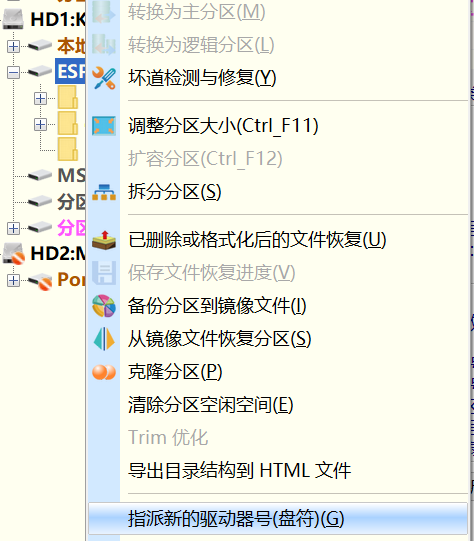
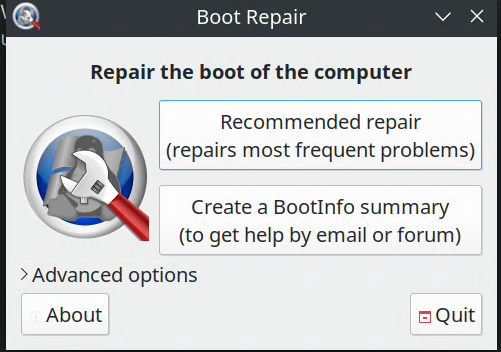
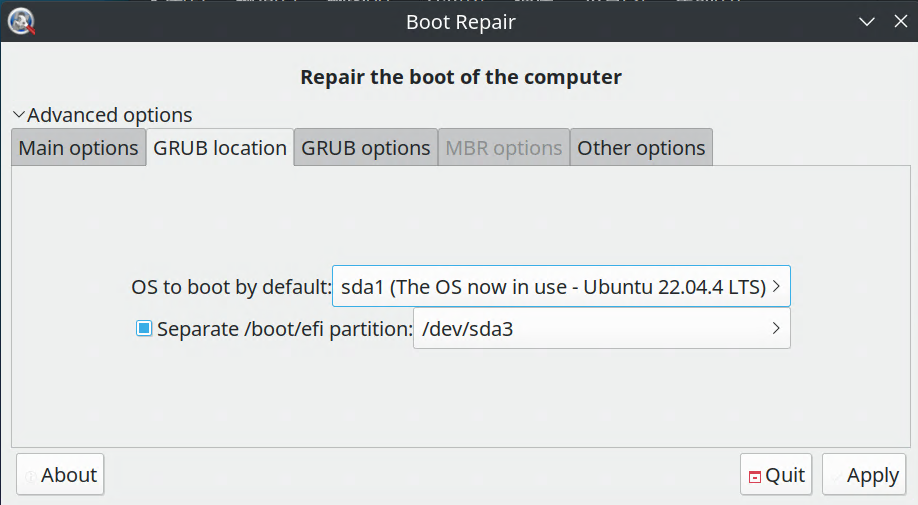
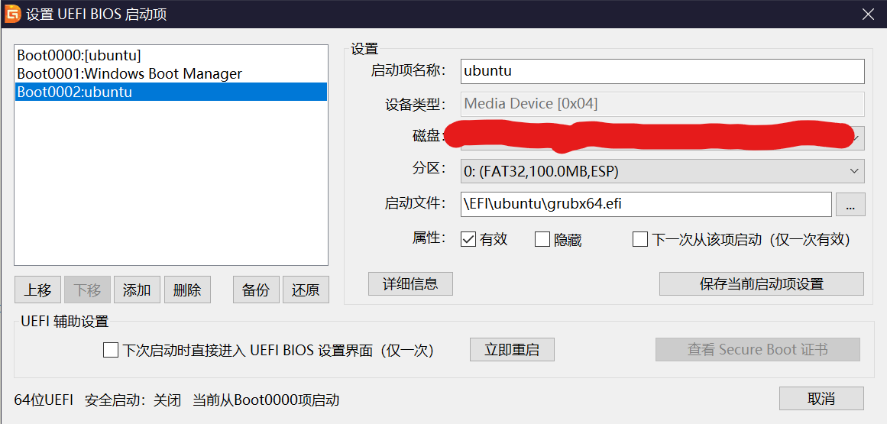

# 系统修复笔记集

## 完整的 chroot 进系统流程（livecd 修系统用）

网上各个地方的 `chroot` 教程都太神金，完全都是残缺的。。。修引导时被坑惨了

在此发个怎样都好的总结版

### 挂载磁盘分区

```bash
sudo fdisk -l
```

无论如何，都得查看你的设备和磁盘分区，才能进行挂载

找到其中 `Linux file system` 和 `EFI system` 的分区的位置（如果不是 `uefi` 引导而是 `bios` 的用户可以忽略此处的 `EFI system` 分区和接下来所述的引导分区相关 ~~但是都4202年了不会还有人再用bios引导吧。。。~~），这个位置要么是类似 `/dev/sda1` 要么是类似 `/dev/nvme0n1p0` 的目录

然后在`/mnt` 下创建一个挂载点文件夹挂载你的系统所在的磁盘分区（`Linux file system` 的那个），这个文件夹名字不重要，此处以 `disk` 作为示例

```bash
sudo mkdir --parents /mnt/disk
```

然后挂载上，把上面找到的系统和引导分区挂载进去

```bash
sudo mount [root] /mnt/disk && mount [esp] /mnt/disk/boot
```

`[root]` 请自行替换为你的 `linux` 系统分区（`Linux file system` 那个）所在位置，`[esp]` 请自行替换为引导分区（`EFI system` 那个）所在位置

一般来说，一块只安装了linux系统的固态硬盘上，引导分区一般是 `/dev/nvme0n1p1`，如果分盘时加了 `MSR` 分区和 `swap` 分区，`linux` 系统分区就会在 `/dev/nvme0n1p4` ，盘上（在`linux` 系统分区之前的）少一个分区那p后的值就 -1 ，否则就 +1 

### 挂载其他路径

```bash
sudo mount --types proc /proc /mnt/disk/proc
sudo mount --rbind /sys /mnt/disk/sys && mount --make-rslave /mnt/disk/sys
sudo mount --rbind /dev /mnt/disk/dev && mount --make-rslave /mnt/disk/dev
sudo mount --bind /run /mnt/disk/run && mount --make-slave /mnt/disk/run
```

这些指令逐行运行即可 ~~最讨厌的一集，本来livecd往往就只有bash能用还要输这么多指令~~

`mount` 指令只要什么都没有返回那就是成功的，实在想怎样的话可以追加 `-v` 

* **当然，只要不是修引导什么的和硬件分区和系统底层有非常大影响的问题，这一段的目录全都可以不挂载，甚至上面那个挂载引导分区到 `/mnt/disk/boot` 的步骤也可以省略，~~这应该就是为什么网上这么多不完整的 `chroot` 方式没有被纠正的原因之一吧~~**

### 进入电脑中磁盘所在的linux系统

```bash
sudo chroot /mnt/disk /bin/bash
```

`/bin/bash` 是在指定shell，其实可以不输

然后

```bash
source /etc/profile
```

激活配置什么的

### 补充（？

最好在 `chroot` 进系统前， 先看一眼 `findmnt` ，看看 `/dev/shm` 是不是符号链接，是的话，挂一下 `tmpfs` 

我的因为本来就是 `tmpfs` 了所以没有做这一步

---

## Linux 系统（使用 grub） 和 Windows 系统重建引导流程 （UEFI）

### Windows

制作 `pe` 启动盘，进入系统，然后挂载 `esp` 分区（此处使用的 `pe` 启动盘是用 `diskgenius` 制作的，内置 `diskgenius`，因此使用该软件进行挂载，即右键选择 `esp` 分区为其分配盘符即可）




可见，我们已挂载 `esp` 分区，并分配了 `i:` 这个盘符（以下重建引导过程以 `esp` 已被挂载且被分配 `i:` 盘符为例）

然后打开 `cmd.exe` （命令提示符），输入

```cmd
bcdboot c:\Windows /s i: /f UEFI
```

等待命令执行完成即可，重启后在  `bios` 中选择正确的启动项即可

### Linux

1. 最懒人化的办法：在（启用了图形化的）安装介质中使用 `Boot-Repair` 傻瓜化修复 （要求系统拥有 `apt` 包管理器），在联网后：

    * ubuntu : 

        添加 `Boot-Repair` 的 `ppa` 源并更新软件包列表
        
        ```bash
        sudo add-apt-repository ppa:yannubuntu/boot-repair && sudo apt update
        ```

        安装并打开 `Boot-Repair` 
        
        ```bash
        sudo apt install -y boot-repair && boot-repair
        ```

    * 其他拥有 `apt` 包安装器的 `linux` 系统（如 `debian`）：

        添加 `Boot-Repair` 的 `gpg` 密钥到 `gpg` 密钥环

        ```bash
        wget -O- https://sourceforge.net/projects/boot-repair/files/key.gpg | sudo tee /etc/apt/keyrings/boot-repair.gpg
        ```

        将描述 `Boot-Repair` PPA 软件源的配置信息写入到 `/etc/apt/sources.list.d/boot-repair.list` 文件中以通过 `apt` 安装

        ```bash
        echo 'deb [signed-by=/etc/apt/keyrings/boot-repair.gpg] https://ppa.launchpadcontent.net/yannubuntu/boot-repair/ubuntu noble main' | sudo tee /etc/apt/sources.list.d/boot-repair.list
        ```

        更新软件包列表并安装 `Boot-Repair`

        ```bash
        sudo apt update && sudo apt install -y boot-repair
        ```

    `Boot-Repair` 启动后界面应当形如：

    

    一般来说点击 `Recommended repair` 即可，但如果需要手动选择需要创建引导的分区和 `esp` 分区位置，则可以点击 `Advanced options`，选择 `GRUB location`

    

    第一个输入框需填入需要重建引导的系统的分区，第二个输入框则需填入要安装 `grub` 引导的 `esp` 分区，之后点击 `Apply` 即可

2. 手动重新安装 `grub` 以修复引导

    在完整 `chroot` 进系统后（记得把目标 `esp` 分区 `mount` 到 `/boot`），输入

    ```bash
    sudo grub-install --efi-directory=/boot/efi --target=x86_64-efi
    ```

    重新安装 `grub`，然后可以输入

    ```bash
    sudo update-grub
    ```

    或者

    ```bash
    sudo grub-mkconfig -o /boot/grub/grub.cfg
    ```

    重新生成 `grub` 配置文件，之后重启即可

### 用 diskgenius 管理启动项

有些时候虽然生成了引导，但是 `bios` 中并没有这个启动项的话，可以用 `diskgenius` 手动生成；以及格式化了 `esp` 分区彻底清除原有引导记录后，`bios` 中的启动项并未同步删除时，也可以用 `diskgenius` 手动删除

在顶部找到工具那一栏，点击最后一项 设置 `UEFI` `BIOS` 启动项



后就可以点击 添加 生成启动项，或点击 删除 去除无用的启动项

一般而言，`windows` 的启动文件是 `esp` 分区的 `\EFI\Microsoft\Boot\bootmgfw.efi`，`linux` 的则是 `\EFI\ubuntu\grubx64.efi`，找到文件添加即可

---

## 设定以纯命令行进入系统

### 关闭图形化界面

`chroot` 或者进系统后输入

```bash
sudo systemctl set-default multi-user.target
```

关闭 `x server` 进入系统，重启生效

### 恢复图形化界面

```bash
sudo systemctl set-default graphical.target
```

启用 `x server` 启用图形化，重启生效

---

## n卡驱动修复（ubuntu）（大概比较粗暴）

一般来说n卡驱动都是在更新驱动时因为依赖问题导致不完全安装，然后重启之后爆炸的。。。所以只要全部删光光再重装就好了）

如果重启之后才发现驱动已经爆炸了，应该是进不去登录界面的（没有显卡，`x server` 显示图形化界面就卡住了）所以需要前置知识：

1. 使用安装介质 `chroot` 进系统

1. 设定系统以纯命令行进入

1. （通过网络重装新驱动的话）用 `nmcli` 工具连接 `wifi` 

    ~~这种情况下网络代理这种事情。。我直接手机开热点然后用 `vpn热点` 什么的透明代理了，手机没root的自行搜索国内源怎么换~~ 

1. （如果网络都用不了。。比如当初我遇到的内核版本低导致 `ax101` 网卡也爆炸了的事情）去 `nvidia` 下了相应 `deb` 包之后想办法丢进电脑然后 `dpkg` 装罢，这样的话还得追加 `mount` 挂载盘的流程 ~~但是如果你会 `chroot` 了那这个应该也能懂了~~ 

    ~~事实上完全可以手机连 `usb` 口，然后 `usb网络共享` 就有网络了，所以这个问题不是问题~~

总之，以下流程要么用 `livecd` 引导启动之后 `chroot` 进系统，关闭图形化界面后，重启启动到电脑的系统，在命令行下连接网络完成以下移除重装n卡驱动的流程，要么给 `livecd` 的系统供网，`chroot` 进去时就完成以下卸载重装（不太推荐，因为livecd下可能读不到设备而出现些奇怪问题。。）

### 找出所有 nvidia 的包 （包括卸载命令输入之后要确认是否完全删除所有n卡驱动也是一样的）

```bash
dpkg -l | grep nvidia
```

### 彻底删除n卡驱动及其依赖

```bash
sudo apt-get --purge remove "*nvidia*"
```

使用上一个命令检查之后，再重新安装最新版n卡驱动

### 使用 ppa 源重新安装最新n卡驱动

```bash
sudo add-apt-repository ppa:graphics-drivers/ppa && ubuntu-drivers autoinstall
```

* 可以在这条命令之前先运行

    ```bash
    ubuntu-drivers devices
    ```

    查看当前适用版本

之后输入 `sudo reboot` 重启，重启后在命令行下输入

```bash
nvidia-smi
```

查看驱动及硬件是否正常运作

如果正常运转，就可以开x server启动了

---
